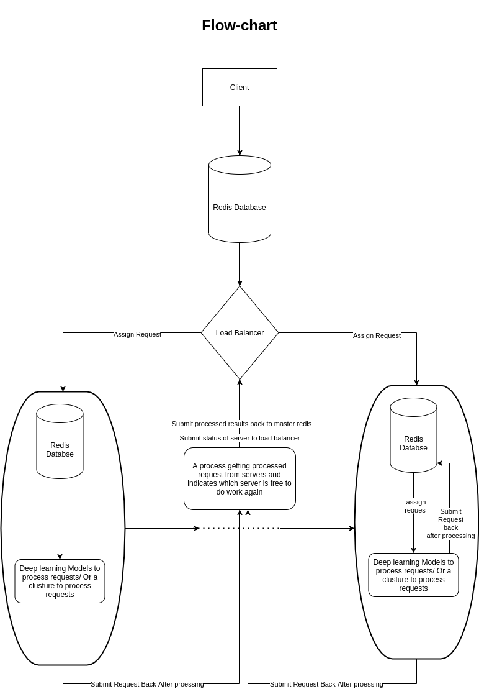
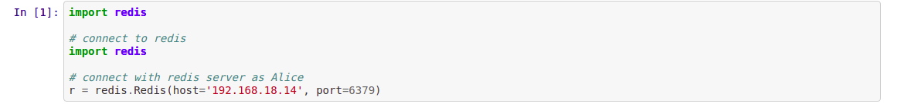
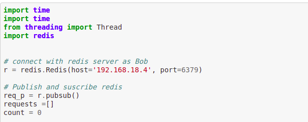
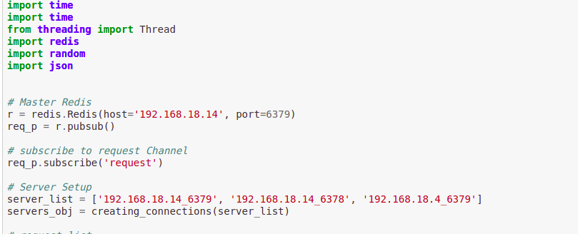

[](http://ansicolortags.readthedocs.io/?badge=latest)
[](https://awesome.re)
[](https://circleci.com/gh/google/pybadges)


# ServerLess Architecture for AI models

It has been more than 20 years since we are using **HTTP/HTTPS** requests for everything, Now I think we have to try something new to make our systems speedy. So I decided to make an architecture which gives us a road from **500ms to 10ms** per request. I am using some new and faster things for support.

    1. Redis (One of the fasted cache databases)
    2. Load balancer (Resource base algorithms)
    3. Python 

<br>

# Architecture Intro 

This architecture includes a master-Redis, load balancer and worker Redis. Let's discuss how this architecture works.

    1. Client submit a request to master-Redis.
    2. Master-Redis ask load balancer(Manager) to submit work to a free worker
    3. Load Balancer get the IP address of the free server and publish a request to worker-Redis (always listing to load-balancer)
    4. Worker-Redis tells the server to process requests.
    5. Server ping's worker-Redis that work is done.
    6. Worker-Redis ping load-balancer that work is done and the server is free
    7. Load balancer submit results to the master-Redis.
    8. Client get results from master Redis.

<br>
<br>

## Flow Chart of architecture


<br>
<br>

# Run code without Docker and Kubernetes

There are 3 files in this architecture

    1. Request file (Works as a client)
    2. Load balancer (Assign requests to the server)
    3. Worker File (File to process request) (you can create as many workers as you want)

<br>

## First we have to start Redis Database

Install docker because we will do all the work on docker images and then run those docker images on Kubernetes

```
docker run -p <map_docker_port>:<server port> --name <give container name here> redis

Like: 
docker run -p 6379:6379 --name <give container name here> redis

If you want to run more instances of Redis then just map the docker Redis port to a free server port

docker run -p 6379:6378 --name redis1 redis
docker run -p 6379:6374 --name redis2 redis
docker run -p 6379:6375 --name redis3 redis
```
<br>
<br>

# Modifications

Now you have to modify some server is with-int scripts. We need to do a change in 3 scripts

1. Change in Request.py:

        Give you master Redis IP here.

<p align="center">
    
</p>

    

2. Change in worker.py 

        You can see the architecture above that every worker has its Redis to subscribe and publish things to load-balancer, So start a Redis docker image first and then give Redis server IP and port in worker script.


<p align="center">
  
</p>


3. Change in load-balancer

        Now you have to connect load-balancer with master-Redis and also give all the IP: port of worker Redis.

<p align="center">
  
</p>


### Now you just have to run request.py and see how much time your request is taking to process.

<br>
<br>

# Run code with Kubernetes

In process


# Architecture Stats

In process


# Release 

    1. 0.0.1


# Author 

* Sohaib Anwaar
* gmail          : sohaibanwaar36@gmail.com
* linkedin       : [Have Some Professional Talk here](https://www.linkedin.com/in/sohaib-anwaar-4b7ba1187/)
* Stack Overflow : [Get my help Here](https://stackoverflow.com/users/7959545/sohaib-anwaar)
* Kaggle         : [View my master-pieces here](https://www.kaggle.com/sohaibanwaar1203)

# Helping Material

* Google
* Redis Documentation
* kubernetes Documentation
* Stack-overflow
* [Super Resolution model Github](https://github.com/SohaibAnwaar/super_resolution.git)


### **Feel free to generate issues and mention bugs on git-repo, Need your help in making this architecture more powerful and bug-free.**
